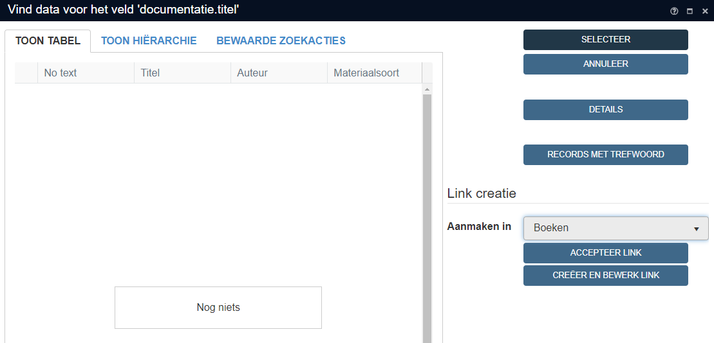
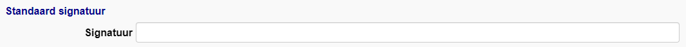
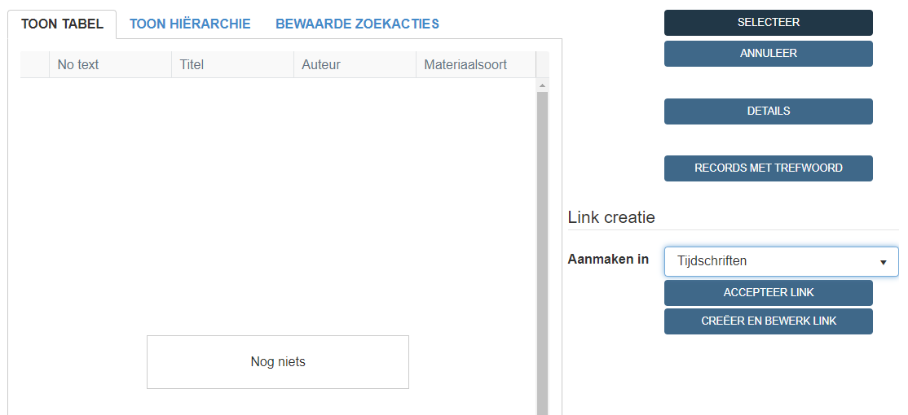
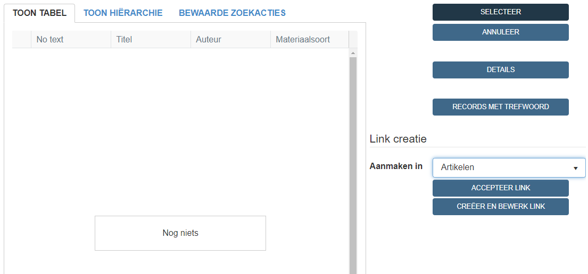

# **Documentatie**

Indien het collectiestuk voorkomt of besproken wordt in een publicatie vullen we deze aan onder het tabblad Documentatie. Er wordt een onderscheid gemaakt tussen: 
- Boeken 
- Tijdschriften/kranten 
- Artikels uit een boek/tijdschrift/krant 

  

    Table of contents
  

  {: .text-delta }
1. TOC
{:toc}

## A. Het werk is aanwezig in de bibliotheekcatalogus van Axiell

Wanneer je de titel intypt krijg je een lijst met opties. Staat het werk reeds hiertussen, klik dit aan. Automatisch worden de velden Auteur en Signatuur (indien aanwezig) aangevuld. 

Enkel de pagina aanduiding moet nog meegegeven worden. Noteer deze als volgt:
- Enkele pagina: p. X 
- Meerdere pagina's (oplopend): p. X-X 
*(vb: p. 15-18)* 
- Meerdere pagina's: p. X, p. X 
*(vb: p. 38, p. 96-97, p. 158)*

Indien er een afbeelding van het collectiestuk aanwezig is in de publicatie, voeg dan ook het nummer van de afbeelding (indien aanwezig) aan. Noteer dit zoals het in de publicatie staat vermeldt.  *(vb: fig. 1, Afb. 1, nr. 1)* 
Indien het collectiestuk deeluitmaakt van een veilingscatalogus, vul ook het catalogusnummer aan. *(vb: p. 35, nr. 125)*

## B. Het werk moet aangevuld worden in de bibliotheekcatalogus van Axiell

## **1. Boeken**

Bij een publicatie in een boek vullen we volgende gegevens aan onder documentatie:

| Veld           | Inhoud                                                                                                                                                                           |
|----------------|----------------------------------------------------------------------------------------------------------------------------------------------------------------------------------|
| Titel          | Exacte titel van het werk                                                                                                                                                        |
| Auteur(s) + rol| Achternaam, Voornaam + auteur                                                                                                                                                    |
| Signatuur      | Standplaatscode WISE (indien aanwezig)                                                                                                                                           |
| Materiaalsoort | Keuze uit:  - boek  - jaarboek  - brochure  - tentoonstellingscatalogus  - veilingscatalogus  - documentatiemap  - thesis                                   |
| Pagina         | Paginanummer(s) waar het collectiestuk voorkomt                                                                                                                                  |

- **Titel**: 
Zet de volledige titel van het werk in het veldje *titel*. Zit het werk in WISE, kopieer dan deze titel. Indien de titel start met een lidwoord, vul dit later afzonderlijk aan bij het veldje 'lidwoord'. 

Voor veilingcatalogi en jaarboeken zijn er vaste structuren:

***Veilingcatalogus***:  
Noteer de titel als volgt: 'Veilingcatalogus Naam Veilinghuis Datum Veiling (DD(-DD)/MM/YYYY)' *(vb: Veilingcatalogus Marc Van de Wiele 6-7/10/2006)* 

***Jaarboek***:  
Noteer de titel als volgt: 'Naam Museum Jaarboek Jaar (YYYY)' *(vb: In Flanders Fields Museum Jaarboek 2019)* 

***Documentatiemap***:  
Noteer de titel als volgt: 'Documentatiemap Achternaam, Voornaam' *(vb: Documentatiemap de Coninck, Pierre)* 

Wanneer je klikt op een volgend veld zal, gezien de publicatie nog niet aanwezig is in de bibliotheekcatalogus van Axiell, er een pop-up venster verschijnen. Kies in de rechterkolom voor **Aanmaken in Boeken** en klik op **Creëer en bewerk link** 

Vul in de documentatiefiche de volgende velden verder aan:
- **Materiaalsoort**: 
Kies voor de correcte optie uit het dropdown menu.

- **Auteur**: 
Vul de auteur aan (achternaam, voornaam). Indien de auteur nog niet aanwezig is in de personendatabank van Adlib zal er een pop-up venster verschijnen. Klik in de rechterkolom op **Accepteer link** en selecteer de persoon in de tabel om deze toe te voegen. Vul auteur aan bij het veldje 'rol auteur'.

- **Signatuur**: 
Als de publicatie aanwezig is in de bibliotheek van het Yper Museum of In Flanders Fields Museum, vul dan bij signatuur de plaatscode uit WISE aan. Boeken uit de bibliotheek van het Yper Museum worden altijd voorafgegaan van MS, boeken uit de bibliotheek van het In Flanders Fields Museum worden voorafgegaan van MI.
*(vb: MS IP 1332)* 

Klik bovenaan de fiche op de diskette om de documentatiefiche op te slaan en klik het werk aan in de tabel om het toe te voegen aan het record.
Enkel de pagina aanduiding moet nog meegegeven worden. Noteer deze als volgt:
- Enkele pagina: p. X 
- Meerdere pagina's (oplopend): p. X-X 
*(vb: p. 15-18)* 
- Meerdere pagina's: p. X, p. X 
*(vb: p. 38, p. 96-97, p. 158)*

Indien er een afbeelding van het collectiestuk aanwezig is in de publicatie, voeg dan ook het nummer van de afbeelding (indien aanwezig) aan. Noteer dit zoals het in de publicatie staat vermeldt.  *(vb: p. 1, fig. 1)* 
Indien het collectiestuk deeluitmaakt van een veilingscatalogus, vul ook het veilingnummer aan. *(vb: p. 35, nr. 125)*

## **2. Tijdschriften/Kranten**

Bij een publicatie in een tijdschrift/krant vullen we volgende gegevens aan onder documentatie:

| Veld           | Inhoud                                                                                                                                                                           |
|----------------|----------------------------------------------------------------------------------------------------------------------------------------------------------------------------------|
| Titel          | Naam tijdschrift, jaargang, nummer / Naam krant, datum uitgave (DD-MM-YYYY)                                                                                                      |
| Signatuur      | Standplaatscode WISE (indien aanwezig)                                                                                                                                           |
| Materiaalsoort | Keuze uit:  - krant  - artikel                                                                                                                                          |
| Pagina         | Paginanummer(s) waar het collectiestuk voorkomt                                                                                                                                  |

- **Titel**: 
Vul de naam van het tijdschrift/krant aan in het veldje *titel*. Indien het tijdschrift/de krant start met een lidwoord, vul dit later afzonderlijk aan bij het veldje 'lidwoord'. Dit doen we als volgt: 
- Tijdschrift: Naam tijdschrift, jaargang, nummer 
*(vb: De Boezingenaar, jg. 32, nr. 3)* 
- Krant: Naam krant, datum uitgave (DD-MM-YYYY) 
*(vb: Le XXe siècle, 05-03-1918)* 

Wanneer je klikt op een volgend veld zal, gezien de publicatie nog niet aanwezig is in de bibliotheekcatalogus van Axiell, er een pop-up venster verschijnen. Kies in de rechterkolom voor **Aanmaken in Tijdschriften** en klik op **Creëer en bewerk link** 

- **Materiaalsoort**: 
Kies voor de correcte optie uit het dropdown menu (tijdschrift of krant).

- **Signatuur**: 
Als de publicatie aanwezig is in de bibliotheek van het Yper museum of het In Flanders Fields Museum, vul dan bij signatuur de plaatscode uit WISE aan. Boeken uit de bibliotheek van het Yper Museum worden altijd voorafgegaan van MS, boeken uit de bibliotheek van het In Flanders Fields Museum worden voorafgegaan van MI.
*(vb: MS IP 1332)* 

Klik bovenaan de fiche op de diskette om de documentatiefiche op te slaan en klik het werk aan in de tabel om het toe te voegen aan het record.
Enkel de pagina aanduiding moet nog meegegeven worden. Noteer deze als volgt:
- Enkele pagina: p. X 
- Meerdere pagina's (oplopend): p. X-X 
*(vb: p. 15-18)* 
- Meerdere pagina's: p. X, p. X 
*(vb: p. 38, p. 96-97, p. 158)*

## **3. Artikels uit Boek/Tijdschrift/Krant**

| Veld                | Inhoud                                                                                                                                                                           |
|---------------------|----------------------------------------------------------------------------------------------------------------------------------------------------------------------------------|
| Titel               | Exacte titel van het artikel                                                                                                                                                     |
| Auteur(s) + rol     | Achternaam, Voornaam + auteur                                                                                                                                                    |
| Bron Titel          | titel van het werk waarin het artikel is opgenomen                                                                                                                               |
| Bron Materiaalsoort | Keuze uit:  - boek  - tijdschrift  - krant                                     |
| Bron Jaargang | Nummer jaargang                                   |
| Bron Aflevering | Nummer aflevering                                   |
| Bron jaar | Jaartal (YYYY)                                   |
| Signatuur           | Standplaatscode WISE (indien aanwezig)                                                                                                                                           |
| Materiaalsoort      | artikel                                                                                                                                                                          |
| Pagina              | Paginanummer(s) waar het collectiestuk voorkomt                                                                                                                                  |

- **Titel**: 
Vul de exacte titel van het artikel aan in het veldje *titel*.

Wanneer je klikt op een volgend veld zal, gezien de publicatie nog niet aanwezig is in de bibliotheekcatalogus van Axiell, er een pop-up venster verschijnen. Kies in de rechterkolom voor **Aanmaken in Artikels** en klik op **Creëer en bewerk link** 

- **Materiaalsoort**: 
Kies voor materiaalsoort artikel

- **Auteur**: 
Vul de auteur aan (achternaam, voornaam). Indien de auteur nog niet aanwezig is in de personendatabank van Adlib zal er een pop-up venster verschijnen. Klik in de rechterkolom op **Accepteer link** en selecteer de persoon in de tabel om deze toe te voegen. Vul auteur aan bij het veldje 'rol auteur'.

- **Bron Titel** 
Vul de exacte titel aan van de bron (boek, tijdschrift, krant) waar het artikel in voorkomt. Wanneer deze nog niet aanwezig is in de bibliotheekcatalogus, wordt deze opnieuw toegevoegd (zie bovenstaande stappen voor boek/tijdschrift/krant)

- **Bron Materiaalsoort** 
Neem de materiaalsoort over zoals omschreven bij de bron

- **Bron Jaar, jaargang, aflevering** 
Vul het nummer van de jaargang, aflevering (indien van toepassing) en het jaar aan.

- **Signatuur** 
Indien het boek/tijschrift/krant aanwezig is in Wise, neem de signatuur over van bij het bronwerk.

Klik bovenaan de fiche op de diskette om de documentatiefiche op te slaan en klik het werk aan in de tabel om het toe te voegen aan het record.
Enkel de pagina aanduiding moet nog meegegeven worden. Noteer deze als volgt:
- Enkele pagina: p. X 
- Meerdere pagina's (oplopend): p. X-X 
*(vb: p. 15-18)* 
- Meerdere pagina's: p. X, p. X 
*(vb: p. 38, p. 96-97, p. 158)*

